# Diagrama de Arquitectura - Fase 5: Facturación
## SanaRed - Google Cloud Platform

```mermaid
graph TB
    subgraph Usuarios["👥 Actores - Fase 5 Facturación"]
        FAC[Facturador]
        AUD[Auditor Médico]
    end

    subgraph OnPremises["🏥 On-Premises SanaRed"]
        HCE[HCE - Oracle On-Premises\nHistoria Clínica + Prestaciones\n+ Diagnósticos + Órdenes]
        ERP[ERP Facturación\nNube Privada del Proveedor\nLocal]
    end

    subgraph Externos["🌐 Sistemas Externos de Origen Documental"]
        LIS[LIS - Azure\nResultados Laboratorio]
        PACS[PACS - Local por Sede\nImágenes Diagnósticas]
        CONSENT[SaaS Firma Electrónica\nConsentimientos Digitales]
        ASEG["Aseguradoras\n(API o Webhook)"]
    end

    subgraph GCP["☁️ Google Cloud Platform"]

        subgraph SEG["🔐 Seguridad y Acceso - LA-SEG-01 / RNF-23/24/25"]
            IDP[Identity Platform\nSSO + OAuth 2.0\nControl por Rol]
            KMS[Cloud KMS\nCifrado AES-256\nen reposo]
            IAM[Cloud IAM\nPermisos por Rol\nFacturador / Auditor]
        end

        subgraph API["🔌 Capa de Integración - LA-INT-01/02 / RNF-04"]
            APIGW[API Gateway\nEndpoint Webhooks Aseguradoras\nAutenticación Token OAuth]
            CF[Cloud Functions\nValidador Idempotente\nVerificación CIE-10\nLA-INT-02]
        end

        subgraph EVENTOS["📨 Mensajería Asíncrona - LA-INT-01 / RNF-17 / LA-RES-02"]
            PUBSUB[Cloud Pub/Sub\nBus de Eventos\nHCE → ERP / ERP → Aseguradora]
            DLQ[Dead Letter Queue\nMensajes fallidos\ntras 3 reintentos\nLA-RES-02]
        end

        subgraph COMPUTE["⚙️ Orquestación - RNF-19 / RF-04/05/06"]
            CR[Cloud Run\nMicroservicio Orquestador\nConsolidación Expediente\nAuto-scaling x2 pico]
            SCHEDULER[Cloud Scheduler\nPolling Periódico\nAseguradoras sin webhook\nRF-02b]
        end

        subgraph STORAGE["🗄️ Almacenamiento - RNF-16 / LA-SEG-01"]
            GCS[Cloud Storage\nBucket Expedientes Digitales\nCifrado KMS / TLS 1.3]
            FIRESTORE[Firestore\nEstados de Expedientes\nControl de Idempotencia\nLA-INT-02]
        end

        subgraph NOTIF["🔔 Notificaciones - RNF-05/11 / RF-03/06"]
            TASKS[Cloud Tasks\nColas de Notificación\nFacturador y Auditor\nMáx 1 min]
        end

        subgraph OBS["📊 Observabilidad - LA-OBS-01 / RNF-18/24"]
            LOGGING[Cloud Logging\nLogs Inmutables\nCorrelation-ID Global\nIP + Usuario + Timestamp]
            MONITOR[Cloud Monitoring\nAlertas SLA 99.9%\nDashboard Estados]
            TRACE[Cloud Trace\nTrazabilidad Distribuida\nHCE → ERP → Aseguradora]
        end

    end

    %% ── FLUJO 1: HCE → ERP (RF-04) ──
    HCE -->|"Evento: prestaciones + CIE-10\nal cerrar episodio"| PUBSUB
    PUBSUB -->|"Valida codificación CIE-10\nIdempotencia por ID episodio"| CF
    CF -->|"Prestaciones válidas\ntransferidas"| ERP
    CF -->|"Mensaje inválido\ntras 3 reintentos"| DLQ
    CF -->|"Notifica error\ncodificación"| TASKS
    TASKS -->|"Alerta: Bloqueado\nCodificación incompleta"| FAC

    %% ── FLUJO 2: Consolidación Expediente (RF-05) ──
    HCE -->|Diagnósticos y órdenes| CR
    LIS -->|Resultados laboratorio| CR
    PACS -->|Imágenes diagnósticas| CR
    CONSENT -->|Consentimientos firmados| CR
    CR -->|"Expediente digital\nconsolidado"| GCS
    KMS -->|Cifrado en reposo| GCS

    %% ── FLUJO 3: Auditoría Médica (RF-06) ──
    CR -->|"Estado: Listo para auditoría"| TASKS
    TASKS -->|"Notificación\n≤ 1 minuto"| AUD
    AUD -->|"Signed URL TTL 15min\nLA-SEG-01"| GCS
    AUD -->|"Aprobación u\nobservación digital"| CR
    CR -->|"Actualiza estado:\nAprobado / Observado"| ERP
    CR -->|"Estado: Observado\nNotifica corrección"| TASKS
    TASKS -->|"Alerta: Observado\nPendiente corrección"| FAC

    %% ── FLUJO 4: Envío a Aseguradora (RF-01) ──
    ERP -->|"Expediente aprobado\nlisto para envío"| PUBSUB
    PUBSUB -->|"Descarga expediente\ncifrado"| GCS
    PUBSUB -->|"Envío por API\nHTTPS + OAuth 2.0"| APIGW
    APIGW -->|"POST expediente\nTLS 1.3"| ASEG
    FIRESTORE -->|"Verifica idempotencia\nno duplicar envíos"| CF

    %% ── FLUJO 5: Respuesta Aseguradora Webhook (RF-02) ──
    ASEG -->|"Webhook: respuesta\nliquidación"| APIGW
    APIGW -->|"Valida token\nOAuth"| CR
    CR -->|"Registra estado:\nAprobado / Observado / Rechazado"| ERP
    CR -->|"Notifica resultado\nal facturador"| TASKS

    %% ── FLUJO 6: Polling Aseguradoras sin Webhook (RF-02b) ──
    SCHEDULER -->|"Consulta periódica\nconfigurable"| APIGW
    APIGW -->|"GET estado\nliquidación"| ASEG
    ASEG -->|Respuesta| CR
    CR -->|"Actualiza estado\nexpediente"| ERP

    %% ── FLUJO 7: Gestión Observados / Rechazados (RF-03) ──
    CR -->|"Estado: Observado\no Rechazado"| TASKS
    TASKS -->|"Alerta con detalle\nmotivo ≤ 1 min"| FAC

    %% ── Seguridad ──
    FAC -->|SSO| IDP
    AUD -->|SSO| IDP
    IDP --> IAM

    %% ── Observabilidad ──
    CF -->|Logs + Correlation-ID| LOGGING
    CR -->|Logs + Correlation-ID| LOGGING
    APIGW -->|Logs + Correlation-ID| LOGGING
    ERP -->|Logs + Correlation-ID| LOGGING
    LOGGING --> MONITOR
    LOGGING --> TRACE
```

---

## Servicios GCP utilizados

| Servicio GCP | Rol en la solución | RF / Lineamiento |
|---|---|---|
| API Gateway | Recepción de webhooks y envío a aseguradoras con autenticación OAuth | RF-01, RF-02, RNF-04 |
| Cloud Pub/Sub | Bus de eventos asíncrono HCE→ERP y ERP→Aseguradora | LA-INT-01, RNF-17 |
| Cloud Functions | Validación CIE-10 e idempotencia en transferencias | LA-INT-02, RNF-08, RF-04 |
| Cloud Run | Orquestador de consolidación de expediente con auto-scaling | RF-05, RF-06, RNF-19 |
| Cloud Scheduler | Polling periódico a aseguradoras sin soporte webhook | RF-02b |
| Cloud Storage | Bucket de expedientes digitales cifrados con KMS | RNF-16, LA-SEG-01 |
| Firestore | Control de idempotencia y estados de expedientes | LA-INT-02, RF-03 |
| Dead Letter Queue | Aislamiento de mensajes con errores tras 3 reintentos | LA-RES-02, RNF-17 |
| Cloud KMS | Cifrado AES-256 en reposo y TLS 1.3 en tránsito | RNF-23, LA-SEG-01 |
| Identity Platform | SSO + OAuth 2.0 + control de acceso por rol | RNF-25, RNF-06, RNF-12 |
| Cloud IAM | Permisos diferenciados por rol (Facturador / Auditor) | RNF-06, RNF-12 |
| Cloud Tasks | Notificaciones al facturador y auditor en ≤ 1 minuto | RNF-05, RNF-11, RF-03, RF-06 |
| Cloud Logging | Logs inmutables con Correlation-ID, IP, usuario y timestamp | LA-OBS-01, RNF-18, RNF-24 |
| Cloud Monitoring | Alertas y dashboards de disponibilidad 99.9% | RNF-10, RNF-14 |
| Cloud Trace | Trazabilidad distribuida del ciclo completo del expediente | LA-OBS-01 |

---

## Volumetría considerada

| Escenario | Transacciones/día | Usuarios concurrentes |
|---|---|---|
| Normal | 10,000 | 1,500 |
| Pico campaña | 20,000 | 3,000 |

Cloud Run escala automáticamente con factor x2 para absorber picos de demanda sin degradación del servicio.
